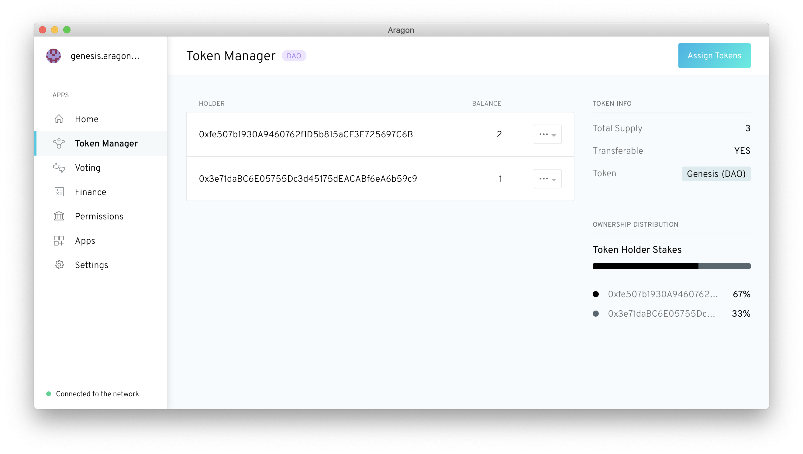

# Aragon Desktop 

Aragon Desktop is an Electron app that runs the Aragon client in a fully decentralized way.

It queries the Ethereum blockchain for the latest version of the app, and then serves it over a local IPFS node.



## Running locally

Requires Node v10.x.

```sh
git clone https://github.com/aragon/aragon-desktop.git
```
Navigate to the aragon-desktop directory
```sh
cd aragon desktop
npm i
npm start
```

Note: if you get an error like the following:

```sh
App threw an error during load:
Error: The module './node_modules/scrypt/build/Release/scrypt.node'
was compiled against a different Node.js version using
NODE_MODULE_VERSION 67. This version of Node.js requires
NODE_MODULE_VERSION 64. Please try re-compiling or re-installing
```

You need to recompile the dependencies with `npm run rebuild`.
